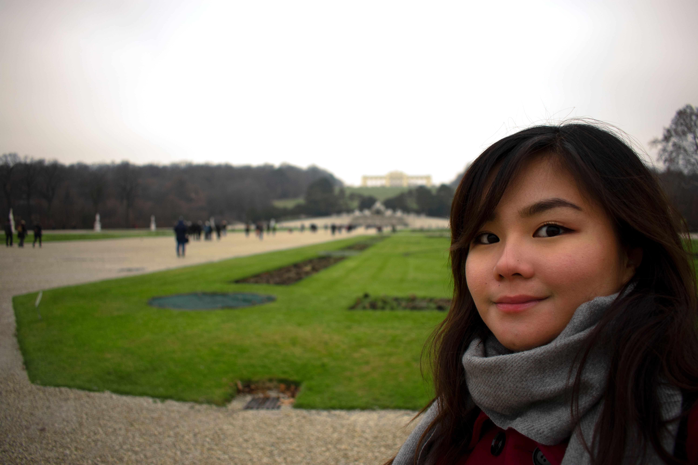

 

## About Me

I'm inspired by dynamic learning. 

I'm a 4th year French and Business Co-op student at the University of Waterloo. Originally from Mississauga, Ontario, I have nearly two years of marketing experience in software, engineering consulting, and e-commerce in the GTA.

I view myself as more than what my traditional education entails. Through my studies and experience, I am an observer of culture. It allows me to have a critical view of the world around me and the many networks and systems in place. I believe in clear and concise communication. When faced with a problem, I tackle it with creativity and realistic measures. 

## My Experience

**Microsoft** , Developer Community Associate

January - August 2018

Program Manager Intern for Microsoft's Commercial Software Engineering (CSE)

**CIMA+** , Marketing & Proposals Coordinator

January - August 2018

CIMA+ is a multidisciplinary firm that specializes in engineering, project management, urban planning, new technologies, and the environment.

**Buytopia (EMERGE)** , Customer Relations & Operations Specialist

September - December 2016

Digital Community & Content Management

#### **RANGLE.IO**, Marketing & Events Coordinator

January - April 2016

A full-stack JavaScript consultancy, specializing in React and Angular.

